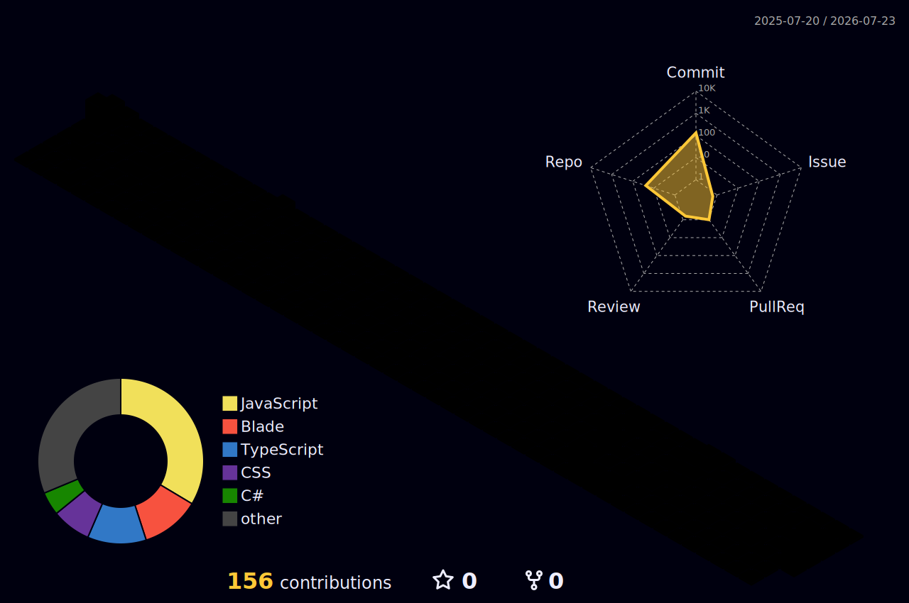

<!-- =========================
     ANIMATED PROFILE BANNER
========================== -->

  

 

<h1 align="center">Md. Mahamodul Hasan Taj</h1>

  <strong>Software Engineer · Full-Stack Developer · CSE Student at AIUB</strong>

  I design and develop modern, secure, responsive, and database-driven software solutions. 
  My primary interests are full-stack web development, backend APIs, software engineering, and scalable business applications.

  
  
  

 

  
  
  

---

## 👨‍💻 Professional Summary

I am **Md. Mahamodul Hasan Taj**, a Computer Science and Engineering student at **American International University-Bangladesh (AIUB)**, majoring in **Software Engineering**.

I enjoy transforming ideas into complete software products—from responsive user interfaces and secure backend APIs to database design, authentication, authorization, testing, and deployment. My project experience includes inventory systems, pharmacy platforms, SaaS applications, desktop software, ticket-management systems, and database-driven business applications.

- 🔭 Currently developing full-stack and business-management applications
- 🌱 Strengthening my skills in scalable architecture, secure APIs, Laravel, Next.js, NestJS, and Django
- 🔐 Interested in authentication, authorization, role-based access control, and application security
- 🤝 Open to internships, junior developer roles, collaborations, and freelance projects
- 📍 Dhaka, Bangladesh
- 🌐 [Visit my portfolio](https://mh-taj-portfolio.vercel.app/)

---

## 🧰 Technical Skills

### Frontend Development

 

### Backend Development

 

### Databases & ORM

 

### Development Tools

 

---

## 🚀 Selected Projects

<table>
  <tr>
    <td width="50%" valign="top">
      <h3>📦 Smart Inventory Management System</h3>
      
<strong>Laravel 13 · Livewire 4 · Flux UI · Tailwind CSS · MySQL</strong>

      

        A complete inventory platform for products, categories, suppliers,
        customers, purchases, sales, returns, stock adjustments, payments,
        reporting, and role-based access control.
      

      

        <a href="https://github.com/Taj22-47271-1/Laravel-project-smart-inventory">
          <strong>View Repository →</strong>
        </a>
      

    </td>
    <td width="50%" valign="top">
      <h3>📊 Smart Business SaaS</h3>
      
<strong>Next.js 16 · Django 5 · Django REST Framework · Tailwind CSS · SQLite</strong>

      

        A business-management SaaS platform with subscriptions, payment approval,
        inventory, invoices, expenses, due tracking, reports, vouchers, team roles,
        and real-time support chat.
      

      

        <a href="https://github.com/Taj22-47271-1/smart-business-saas">
          <strong>View Repository →</strong>
        </a>
      

    </td>
  </tr>
  <tr>
    <td width="50%" valign="top">
      <h3>💊 Pharmacy Management System</h3>
      
<strong>Next.js · React · NestJS · PostgreSQL · JWT</strong>

      

        A secure full-stack pharmacy system with authentication, OTP verification,
        medicine inventory, supplier management, billing flow, and REST APIs.
      

      

        <a href="https://github.com/Taj22-47271-1/Pharmacy_Management_System">
          <strong>View Repository →</strong>
        </a>
      

    </td>
    <td width="50%" valign="top">
      <h3>🛒 Super Shop Management System</h3>
      
<strong>PHP · MySQL · HTML · CSS · JavaScript</strong>

      

        A database-driven web application for product management,
        business operations, user interaction, and shop-management workflows.
      

      

        <a href="https://github.com/Taj22-47271-1/Supershop_webtech_project">
          <strong>View Repository →</strong>
        </a>
      

    </td>
  </tr>
</table>

  <a href="https://mh-taj-portfolio.vercel.app/#projects">
    <strong>Explore all projects on my portfolio →</strong>
  </a>

### Project Portfolio

| Project | Technology | Highlights |
|---|---|---|
| [Smart Inventory Management System](https://github.com/Taj22-47271-1/Laravel-project-smart-inventory) | Laravel 13, Livewire 4, Flux UI, Tailwind CSS, MySQL | Product, supplier, customer, purchase, sales, returns, stock, payments, reporting, and role-based access management |
| [Smart Business SaaS](https://github.com/Taj22-47271-1/smart-business-saas) | Next.js 16, Django 5, Django REST Framework, Tailwind CSS, SQLite | Subscription plans, payment approval, inventory, invoices, due tracking, expenses, vouchers, team roles, reports, and real-time support chat |
| [Pharmacy Management System](https://github.com/Taj22-47271-1/Pharmacy_Management_System) | Next.js, React, NestJS, PostgreSQL, JWT | Secure authentication, OTP verification, medicine inventory, supplier management, billing, and REST APIs |
| [Super Shop Management System](https://github.com/Taj22-47271-1/Supershop_webtech_project) | PHP, MySQL, HTML, CSS, JavaScript | Product management, database connectivity, and web-based business operations |
| [C# Desktop Application](https://github.com/Taj22-47271-1/C_SHARP_PROJECT) | C#, .NET Framework, Windows Forms, OOP | Desktop interface development, object-oriented design, testing, and debugging |
| [C# Super Shop](https://github.com/Taj22-47271-1/C-Super-shop) | C#, .NET Framework, Windows Forms, SQL Server | Product, pricing, and database management for a desktop business application |
| [Plane Ticket Management System](https://github.com/Taj22-47271-1/JavaProject) | Java, OOP, GUI, Database | Passenger information, ticket booking, scheduling, and ticket management |
| [React Frontend Projects](https://github.com/Taj22-47271-1/all-react-projects) | React, Vite, Axios, CSS | Reusable components, routing, API integration, and responsive interfaces |
| [Database Management System](https://github.com/Taj22-47271-1/database) | Oracle SQL, MySQL, SQL | Database design, normalization, CRUD operations, queries, and schema management |

  

---

## 💼 Professional Experience

### Full-Stack Development Intern
**Codveda Technologies · Remote, India**  
`June 2026 – Present`

- Develop frontend and backend application components
- Integrate REST APIs and connect database-driven functionality
- Improve application performance, maintainability, and scalability
- Contribute to complete digital products and software solutions

### Office Operations & Client Support
**Future Cloud Bangladesh Limited · Banani, Dhaka**

- Managed office operations, documentation, reporting, and workflow coordination
- Communicated with international clients through email, chat, and calls
- Supported BPO and IT-enabled service operations
- Maintained business data and reports using Microsoft Excel and Word
- Strengthened communication, teamwork, multitasking, and customer-support skills

---

## 🏅 Certifications

| Certification | Issuer | Date |
|---|---|---|
| [Elements of AI](https://certificates.mooc.fi/validate/16ote8ilfnkh) | University of Helsinki & MinnaLearn | June 26, 2026 |
| [Responsive Web Design](https://freecodecamp.org/certification/mhtaj/responsive-web-design) | freeCodeCamp | 2026 |
| [Critical Thinking in the AI Era](https://www.life-global.org/certificate/aa3da6f6-c74b-454a-9725-a092e011d478/aa3da6f6-c74b-454a-9725-a092e011d478.pdf) | HP LIFE / HP Foundation | June 26, 2026 |
| [Agile Project Management](https://www.life-global.org/certificate/db94c346-9deb-44f8-a52f-38b45f4e9bef) | HP LIFE / HP Foundation | June 26, 2026 |
| [Introduction to Cybersecurity Awareness](https://www.life-global.org/certificate/17b48619-b26f-4c9c-9b07-65e402083929) | HP LIFE / HP Foundation | June 26, 2026 |
| [Data Science & Analytics](https://www.life-global.org/certificate/976512d0-07dd-4627-bbac-9374a1cbb745) | HP LIFE / HP Foundation | June 26, 2026 |

---

## 🎓 Education

| Qualification | Institution | Period |
|---|---|---|
| BSc in Computer Science and Engineering | American International University-Bangladesh (AIUB) | 2022 – Present |
| Higher Secondary Certificate (HSC) | Shahid Mamun Mahmud Police Line School & College, Rajshahi | 2019 – 2020 |
| Secondary School Certificate (SSC) | Sristy Central School & College, Rajshahi | 2017 – 2018 |

---

## 📊 GitHub Performance

  
  

 

  

 

  

---

## 🌐 3D Contribution Graph

---

## 🐍 Contribution Activity

  <picture>
    <source media="(prefers-color-scheme: dark)" srcset="./dist/github-contribution-grid-snake-dark.svg" />
    <source media="(prefers-color-scheme: light)" srcset="./dist/github-contribution-grid-snake.svg" />
    
  </picture>

---

## 🤝 Services

- Full-Stack Web Application Development
- Frontend Development with React and Next.js
- Backend API Development with NestJS, Laravel, and Django
- Authentication and Role-Based Access Control
- Relational Database Design and SQL
- Responsive Portfolio and Business Website Development

---

## 📬 Contact

| Platform | Details |
|---|---|
| Portfolio | [mh-taj-portfolio.vercel.app](https://mh-taj-portfolio.vercel.app/) |
| Email | [mhtaj655@gmail.com](mailto:mhtaj655@gmail.com) |
| Phone | [+880 1728-662572](tel:+8801728662572) |
| Location | Dhaka, Bangladesh |
| LinkedIn | [Md. Mahamodul Hasan Taj](https://www.linkedin.com/in/mahamodul-hasan-taj-1a1926293/) |
| GitHub | [Taj22-47271-1](https://github.com/Taj22-47271-1) |

 

  

  <h3>Thank you for visiting my GitHub profile.</h3>
  
Open to internships, junior developer positions, collaborations, and professional software-development opportunities.

